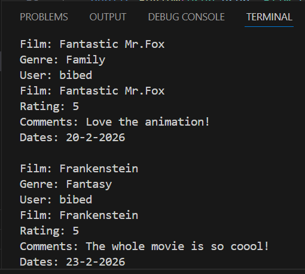

# OOP Project (26/03/26)
### Elisabeth La Satta Sitorus | 039

### 1. Deskripsi Kasus
Seorang user ingin meninggalkan review tiap selesai menonton film, dia membutuhkan sebuah sistem yang bisa mencatat review user tersebut dari nama film, genre film, rating, komentar atas film, hingga tanggal log reviewnya.
Maka, dari masalah tersebut dibuatlah class diagram untuk menggambarkan kelas apa saja yang dibutuhkan dan relasinya, yang nantinya akan diagram tersebut akan diimplementasikan ke dalam suatu sistem. 

### 2. Class Diagram


by Mermaid.ai

### 3. Kode Program Java
```java
class User {
    private String username;

    //Constructor User
    public User(String username) {
        this.username = username;
    }
 
    public String getUsername() {
        return username;
    }
    
    public void setUsername(String username) {
        this.username = username;
    }
}

class Film {
    private String title;
    private String genre;

    //Constructor Film
    public Film(String title, String genre) {
        this.title = title;
        this.genre = genre;
    }

    //Setter & Getter atribut Film
    public String getTitle() {
        return title;
    }

    public void setTitle(String title) {
        this.title = title;
    }

    public String getGenre() {
        return genre;
    }

    public void setGenre(String genre) {
        this.genre = genre;
    }

    //Method untuk Menampilkan Detail Film
    public void showFilm() {
        System.out.println("Film: " + title);
        System.out.println("Genre: " + genre);
    }
}

class Review {
    private User user;
    private Film film;
    private int rating;
    private String comments;
    private String date;

    //Constructor Review
    public Review(User user, Film film, int rating, String comments, String date) {
        this.user = user;
        this.film = film;
        this.rating = rating;
        this.comments = comments;
        this.date = date;
    }

    //Method untuk Menampilkan Hasil Review
    public void showReview() {
        System.out.println("User: " + user.getUsername());
        System.out.println("Film: " + film.getTitle());
        System.out.println("Rating: " + rating);
        System.out.println("Comments: " + comments);
        System.out.println("Dates: " + date);
    }
}

//Main program
public class Main {
    public static void main(String[] args) {
        //Object yang dihasilkan adalah user, film, & review
        User user1 = new User("bibed");
        Film film1 = new Film("Fantastic Mr.Fox", "Family");
        Film film2 = new Film("Frankenstein", "Fantasy");

        Review review1 = new Review(
            user1, film1, 
            5, "Love the animation!", "20-2-2026");

         Review review2 = new Review(
            user1, film2, 
            5, "The whole movie is so coool!", "23-2-2026"); 
            
            film1.showFilm();
            review1.showReview();

            System.out.println();

            film2.showFilm();
            review2.showReview();
        }
    }
```

### Output


### 4. Penjelasan OOP
Di program ini, saya menggunakan beberapa prinsip OOP yaitu Encapsulation, Setter & Getter, Class & Object, Constructor, Method, dan hubungan antar kelasnya Association.

#### a. Encapsulation
Encapsulation adalah proses membungkus suatu data. Di program salah satu bagian Encapsulation adalah bagian berikut,
```java
class Film {
    private String title;
    private String genre;
    }
```
: Jadi, di `class Film` ada atribut `title` dan `genre` yang dibungkus secara private. Atribut-atribut tersebut dibungkus karena dibuat dengan modifiers **private** sehingga atribut tidak dapat diakses dari luar kelas.

#### b. Setter & Getter
Untuk mengakses dan mengubah nilai atribut-atribut yang diprivate tadi, dapat menggunakan Setter & Getter. Salah satu bagian Setter & Getter di program adalah bagian berikut,
```java
public String getTitle() {
        return title;
    }

    public void setTitle(String title) {
        this.title = title;
    }
```
: Atribut `title` dan `genre` yang diprivate tadi sekarang dapat diakses melalui `getTitle()` dan dapat diubah melalui `setTitle()`.

#### c. Class & Object
Tiap class yang ada di program adalah bentuk implementasi dari class diagram yang dihasilkan. `Class` adalah *blueprint* atau rancangan dasar untuk objek yang nanti akan dibuat, `Class` yang ada di program diantaranya adalah `User`, `Film`, dan `Review`.
```java
class User {
    ...
    }

class Film {
    ...
    }

class Review {
    ...
    }
```

Selanjutnya untuk `Object` sendiri adalah hasil nyata atau entitas fisik dari `Class`. Beberapa `Object` yang dihasilkan dari `Class` yang sudah dibuat adalah berikut,
```java
 User user1 = new User("bibed");
        Film film1 = new Film("Fantastic Mr.Fox", "Family");
        Film film2 = new Film("Frankenstein", "Fantasy");

Review review1 = new Review(
            user1, film1, 
            5, "Love the animation!", "20-2-2026");

         Review review2 = new Review(
            user1, film2, 
            5, "The whole movie is so coool!", "23-2-2026"); 
```
: `Object` nya ada user1, film1, film2, review1, dan review2.

#### d. Constructor
Constructor adalah method khusus yang digunakan untuk membuat atau menginisialisasi objek dari sebuah class. Berikut contoh bagian Constructor di program,
```java
 public Film(String title, String genre) {
        this.title = title;
        this.genre = genre;
    }
```
: Memberi nilai awal untuk `title` dan `genre` supaya saat dipanggil nanti ada nilainya.

#### e. Method
Method adalah perilaku objek yang digunakan untuk melakukan suatu tindakan. Berikut contoh bagian Method di program,
```java
 public String getTitle() {
        return title;
    }

    public void setTitle(String title) {
        this.title = title;
    }

 film1.showFilm();
            review1.showReview();
```
: Method yang dipakai di sini adalah `Setter & Getter`, `showFilm(), dan `showReview().

#### f. Association
Tiap kelas akan memiliki hubungan yang mewakili relasi mereka, di program ini, ada Association yang mewakili relasi antar kelas. Association berarti dua kelas saling berhubungan atau saling menggunakan. Berikut bagian yang menunjukkan Association,
```java
class Review {
    private User user;
    private Film film;
}
```
: `Review` menggunakan Class `Film` dan `User` dalam Classnya yang artinya mereka saling berhubungan. Dapat dilihat juga dari tanda panah di class diagram.

: Hal ini juga akan digarisbawahi sebagai **keunikan** di program ini, terdapat beberapa `Class` yang saling berhubungan dan sistem di mana satu User dapat mereview beberapa film yang berbeda seperti konsep aplikasi Letterboxd.
